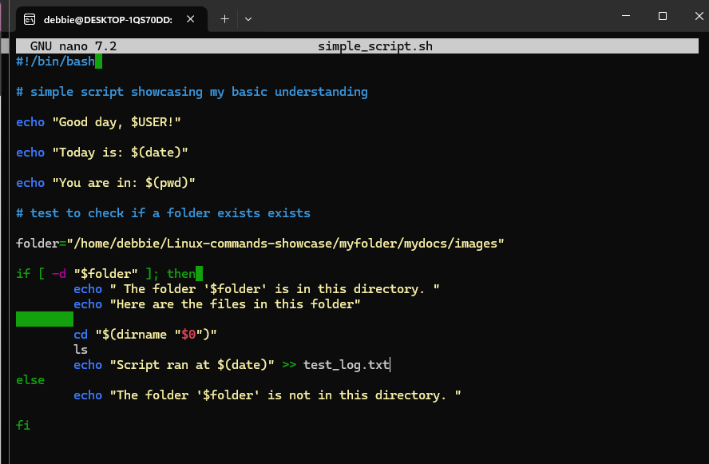
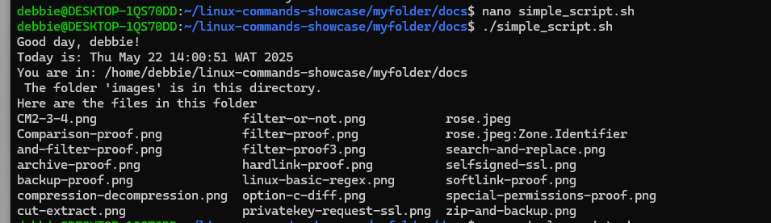
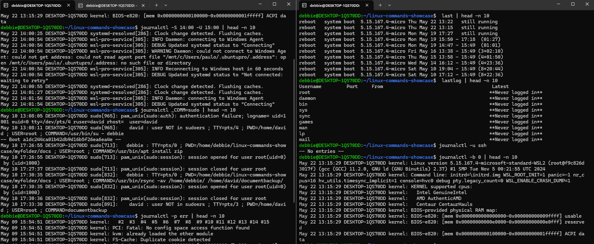
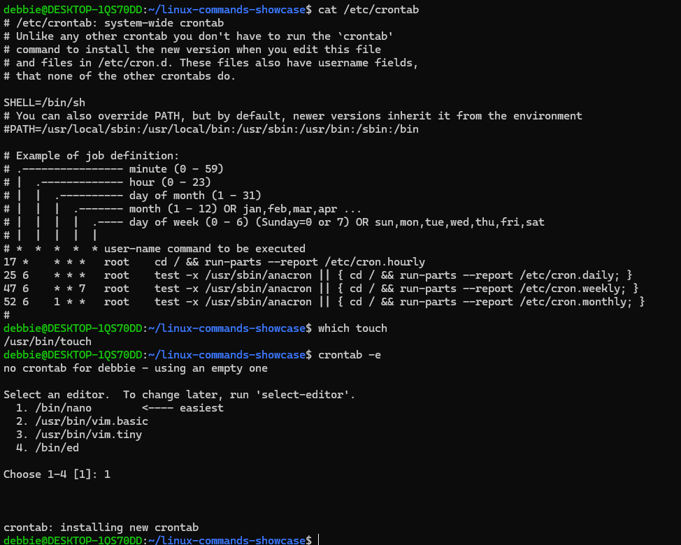
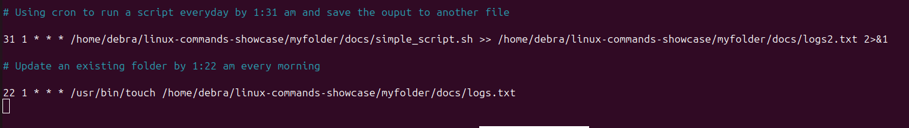
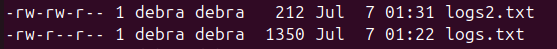
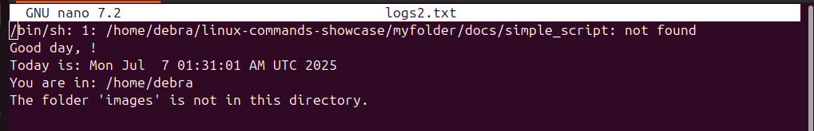

# Operations Deployment 

## BOOT, REBOOT and SHUT DOWN

Essential Linux commands for starting, restarting and shutting down a system

Command used to restart the system immediately: `sudo systemctl reboot` 

Command used to force close all programs: `sudo systermctl reboot --force`

Command used for scheduled reboot: `sudo shutdown -r +1 'scheduled restart'`

**NOTE** A wall message was added in the last illustration to be displayed to other users logged into Linux systems

Command used to shutdown: `sudo systemctl poweroff` 

Comman to schedule shutdown: `sudo shutdown +1` 

## SCRIPTING 

Command used: `touch simple_script.sh`

Then open the file: `nano simple_script.sh`

Then: `chmod +x simple_script.sh`

To execute file: `./simple_script.sh`

## LOCATE AND ANALYSE SYSTEM LOG FILES

To view entire log file: `cat /var/log/syslog`

To get real time updates: `tail -f /var/log/syslog`

Using `journalctl` to query and view logs

 
- `journalctl -u ssh`  view SSH service logs
- `journalctl -b 0` to see logs generated since current boot (to see previous boot use `-1`)
- `journalctl -S 14:00 -U 15:00` to see logs from 2pm to 3pm can be used for dates too
- `journalctl _COMM=sudo` to see logs related to sudo activity
- `journalctl -p err` show only error-level logs (other options include: emerg, alert, crit, emerg, warning etc)

**OTHERS**
- `last` to see login history
- `lastlog` shows when each user last logged in the last time

## Scheduling Tasks to run at a set date and time 

### USING CRON

To understand the cron tab syntax 

Command used: `cat /etc/crontab`

To edit crontab

Command used: `crontab -e`

To use touch command path to command must be added to the crontab

Command used to find touch path: `which touch` 

My crontab command:

`2>&1` helps us to send error crontab may have running the file to the document 

Using `ls -l` command to see that the 2 documents are created at the respective times specified

Using `nano logs2.txt` to see the output of the script has been run succefully

